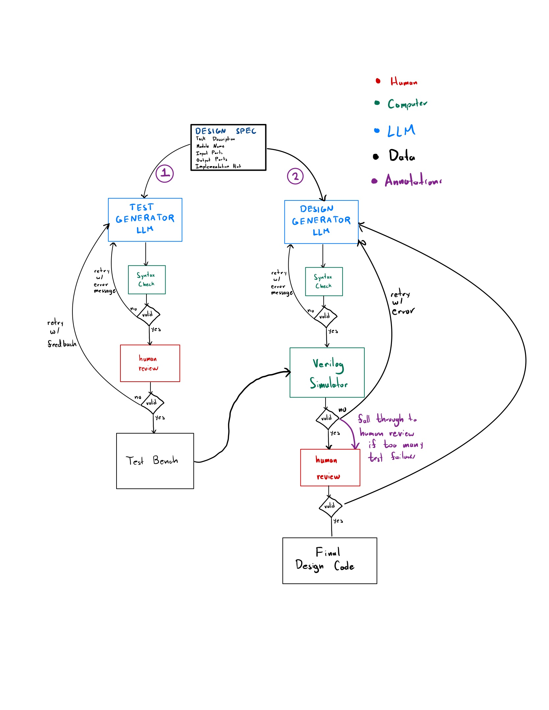

## Design Diagram
Not all of this is currently implemented


## How to Run

### Prerequisites:
- OpenAI API Key
- Design spec with following fields

**Design Spec**
- Task Description
- Module Name
- Input Ports
- Output Ports
- Implementation Hint (optional)

### Steps
1. Set OPENAI_API_KEY environment variable
2. Run `python src/main.py`
3. Specify your design doc, follow the buttons to generate a testbench and design

## Running RTLLM Benchmarks

To run RTLLM benchmarks, follow these steps:

1. Install Verilator 5.002+
    - If on Apple, you may need to build from source to fix C++ versioning issues with coroutine compatibility: https://github.com/verilator/verilator/issues/5190

2. Update the makefile to use verilator instead of vcs
```
TOP_NAME := testbench
SRC_FILE := {{design_file.v}}
CXXFLAGS := "-std=gnu++20 -fcoroutines"

.PHONY: run clean

obj_dir/V$(TOP_NAME): testbench.v $(SRC_FILE)
	verilator --Wno-fatal --binary testbench.v $(SRC_FILE) 

run: obj_dir/V$(TOP_NAME)
	./obj_dir/V$(TOP_NAME)

clean:
	rm -rf obj_dir

```

3. Replace any tristate logic in the code, as Verilator does not currently support it.

4. Run make obj_dir/V$(TOP_NAME) and then run obj_dir/V$(TOP_NAME)
